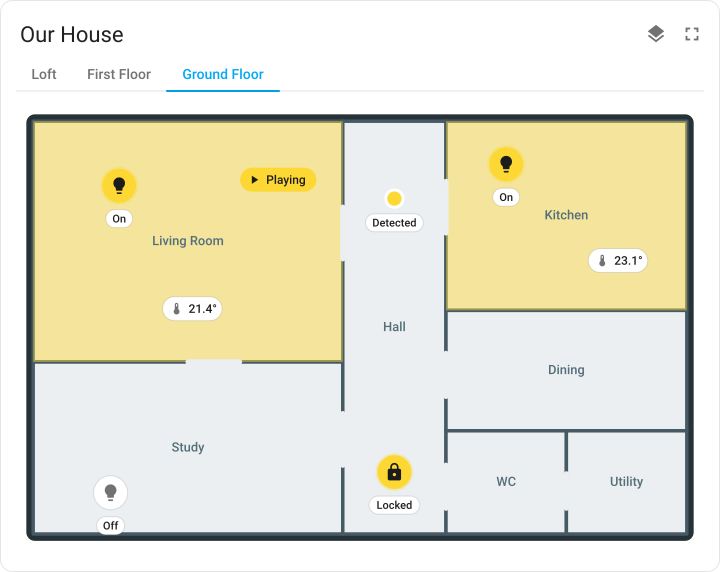

# Home Layout Card

[](https://hacs.xyz)
[](https://www.home-assistant.io)
[](LICENSE)

A Lovelace card for Home Assistant that shows **your whole house, one storey at a time** —
a floorplan image per storey with live entity markers placed on top of it, plus a visual
editor for building the whole thing by clicking and dragging.

No Python, no `custom_components`, no restart: it is a single frontend resource.

<p align="center">
  <picture>
    <source media="(prefers-color-scheme: dark)" srcset="docs/preview-dark.svg">
    
  </picture>
</p>

**Contents** — [What it does](#what-it-does) · [Install](#installation) ·
[Quick start](#quick-start) · [Floorplans](#getting-a-floorplan) ·
[Configuration](#configuration) · [Room highlights](#room-highlights-svg_bindings) ·
[Demo](#trying-it-without-home-assistant) · [Troubleshooting](#troubleshooting)

## What it does

- **Any number of storeys.** Switch with tabs, pills or a dropdown; the card remembers
  which storey you were last looking at.
- **Any floorplan.** SVG, PNG, JPG or WebP, with an optional dark-theme variant per storey.
- **Live markers.** Five styles — icon puck, icon + state badge, text label, dot, and a
  whole-room area that lights up. Every marker follows its entity's icon, colour and state.
- **Room highlights.** If the storey is an inline SVG, any shape in it can be tinted by
  entity state — the kitchen floor glows when the kitchen light is on.
- **All-storeys view.** One button stacks every floor into an isometric pile so you can
  see the whole house at once; tap a storey to open it.
- **Zoom and pan.** Scroll or pinch to zoom into a corner of a big plan, drag to move,
  double-click to reset.
- **Actions.** Tap, hold and double-tap each map to more-info, toggle, navigate, a
  service call, or nothing.
- **A real visual editor.** Add storeys, set images, then click the plan to drop a marker
  and drag it where it belongs. Positions are stored as percentages, so swapping in a
  bigger image later does not move anything.

Requires Home Assistant **2023.9** or newer. Works on any dashboard, in any theme, on
desktop and mobile.

## Installation

### HACS (recommended)

HACS is a third-party community store, not part of Home Assistant. If you do not already
have it, install it first — see
[the HACS download docs](https://www.hacs.xyz/docs/use/download/download/), or the
container-specific steps below. Once installed it appears as its own icon in the **left
sidebar**; it is never listed under Settings.

1. Sidebar → **HACS** → ⋮ → **Custom repositories**
2. Repository: `https://github.com/vteam-com/HA-Floors` — type **Dashboard**
   (called **Lovelace** in older HACS versions)
3. Install **Home Layout Card**, then hard-reload the browser (Ctrl/Cmd + Shift + R)

<details>
<summary><strong>Installing HACS on a container install (Synology NAS, Docker)</strong></summary>

Container installs cannot use the *Get HACS* app — there is no app store. Run the
installer inside the container instead:

1. **Container Manager → Container → `homeassistant` → Terminal → Create → `bash`.**
   On plain Docker, or over DSM SSH (**Control Panel → Terminal & SNMP → Enable SSH
   service**), the equivalent is `docker exec -it homeassistant bash`.
2. Run:

   ```bash
   wget -O - https://get.hacs.xyz | bash -
   ```

3. Restart the container (**Action → Restart**).
4. **Settings → Devices & Services → + Add Integration → HACS**, and authorize with GitHub.

HACS then appears in the sidebar and the three steps above apply.

If you would rather not use a terminal: download `hacs.zip` from the
[HACS releases page](https://github.com/hacs/integration/releases/latest), and extract it
with File Station into `custom_components/hacs/` inside the config folder (so that
`custom_components/hacs/manifest.json` exists), then continue from step 3.

</details>

### Manual

Manual install means putting one JavaScript file into Home Assistant's **configuration
directory** and then telling the dashboard to load it. The tricky part is usually getting
at that directory, so step 1 covers the common ways.

#### 1. Get access to the configuration directory

This is the folder holding `configuration.yaml`. It is on the Home Assistant machine, not
on your PC. Pick whichever access method suits your install:

| Your install | How to get in |
| --- | --- |
| HA OS / Supervised | **Settings → Apps → App store**, install **Studio Code Server** (full editor, supports drag-and-drop upload) or **File editor** (lighter). Open it from the sidebar. |
| HA OS / Supervised, prefer a network drive | Install the **Samba share** app, then mount `\\<ha-ip>\config` (Windows) or `smb://<ha-ip>/config` (macOS) and copy files in Finder/Explorer. |
| HA OS / Supervised, prefer a terminal | Install the **Advanced SSH & Web Terminal** app, then `scp` into it. The config directory is `/config`. |
| Docker / Container | The directory is whatever you bind-mounted to `/config` in your `docker-compose.yml` or `docker run` command. Copy files there directly on the host. |
| Synology NAS (container) | See [Synology NAS](#synology-nas-container-manager) below. |
| Core (venv) | Usually `~/.homeassistant/`. |

Older docs and forum posts call these apps *add-ons* — Home Assistant renamed them to
**Apps**, but they are the same thing.

##### Synology NAS (Container Manager)

A container install has no Supervisor, so **Settings has no Apps / Add-ons section at all**
— File editor, Samba share and Terminal are not available to you. Use DSM's own tools
instead.

**Find the folder.** Open **Container Manager** (called **Docker** on DSM 7.1 and older)
→ **Container** → your `homeassistant` container → **Details** → **Storage** tab, and look
for the NAS folder mapped to `/config`. A typical one is
`<share>/docker/homeassistant`.

> **There is no folder named `config` on the NAS — do not go looking for one.** `/config`
> is the path *inside* the container; Docker maps your NAS folder onto it. You are in the
> right folder when you see `.storage`, `blueprints`, `deps` and `tts` sitting in it.
> `configuration.yaml` is in there too, but File Station's left-hand tree lists folders
> only — click the folder and check the file pane on the right to see it.

**Copy the file in.** Either way works:

- **File Station** — browse to that folder, use **Create → Create folder** to add `www`
  next to `blueprints` and `deps`, then **Upload** `home-layout-card.js` into it.
- **Network share** — in **Control Panel → Shared Folder**, confirm your account can reach
  the share holding it, then open `\\<nas-ip>\<share>\docker\homeassistant\www`
  (Windows) or `smb://<nas-ip>/<share>/docker/homeassistant/www` (macOS) and drag the file
  in. `<share>` is whatever your shared folder is called — the top-level name in File
  Station, not necessarily `docker`.

The result should look like this:

```
homeassistant/          ← this is /config inside the container
├── configuration.yaml
├── .storage/
├── blueprints/
├── deps/
├── tts/
└── www/                ← create this
    └── home-layout-card.js
```

**Restart.** Container Manager → select the `homeassistant` container → **Action →
Restart**. Home Assistant's own **Settings → System → ⋮ → Restart** only comes back if the
container's restart policy is `always` or `unless-stopped`; otherwise it just stops and you
restart it from Container Manager anyway.

Then carry on with step 3 below — the resource URL is still `/local/home-layout-card.js`.

#### 2. Copy the file into `www/`

Create a folder named `www` inside the configuration directory if it does not exist, then
copy [`dist/home-layout-card.js`](dist/home-layout-card.js) from this repository into it:

```
<configuration directory>/
├── configuration.yaml
└── www/
    └── home-layout-card.js
```

The directory itself is not necessarily *named* `config` — on a container install it is
whatever host folder you mapped to `/config`. Identify it by its contents
(`configuration.yaml`, `.storage/`), not its name.

Anything in `www/` is served to the browser at `/local/`, so that file becomes
`/local/home-layout-card.js`.

> **If you just created `www/` for the first time, restart Home Assistant**
> (**Settings → System → ⋮ → Restart Home Assistant**). The `/local/` path is only wired up
> at startup, so until you restart, the file will 404 and the card will silently fail to
> load.

#### 3. Register it as a dashboard resource

**Settings → Dashboards → ⋮ (top right) → Resources → + Add resource**

- URL: `/local/home-layout-card.js`
- Type: **JavaScript module**

> **No Resources entry in that menu?** It is hidden unless Advanced Mode is on. Click your
> name at the bottom of the sidebar to open your profile and turn on **Advanced Mode**, then
> reload the page.

#### 4. Hard-reload the browser

Ctrl/Cmd + Shift + R. Browsers cache dashboard resources aggressively, so a normal reload
often is not enough — this is also true every time you update the file later.

To confirm it loaded, open the browser console: the card prints its name and version on
startup. If you see nothing, open `http://<your-ha>:8123/local/home-layout-card.js`
directly — if that 404s, the file is not where you think it is, or Home Assistant has not
been restarted since you created `www/`.

## Quick start

Copy `examples/ground-floor.svg` from this repository to `config/www/floorplans/` (same
configuration directory as above — see [Manual](#manual) if you are not sure how to get
there), then add this card to a dashboard:

```yaml
type: custom:home-layout-card
title: Home
floors:
  - name: Ground Floor
    image: /local/floorplans/ground-floor.svg
    markers:
      - entity: light.living_room
        x: 17
        y: 22
```

That is a working card. From there, open the card's **visual editor** and click the plan
to drop the rest of your entities — everything below is available there too.

## Getting a floorplan

Put image files in `config/www/` — anything there is served from `/local/`. So
`config/www/floorplans/ground.svg` is referenced as `/local/floorplans/ground.svg`.

Three ways to get one:

- **Draw it.** Any tool that exports SVG works ([Inkscape](https://inkscape.org),
  Figma, draw.io, Excalidraw). Keep one shape per room and give each an `id` if you want
  room highlights.
- **Trace it.** Screenshot the plan from your house survey, trace the walls, export.
- **Start from the samples.** `examples/ground-floor.svg`, `first-floor.svg` and `loft.svg`
  in this repository are complete three-storey plans with light and dark variants and
  `id`s on every room. Copy them to `config/www/floorplans/` and edit from there.

SVG is worth the extra effort: it stays sharp at any size, the file is a few KB, and it
is the only format that supports room highlights.

## Configuration

Add the card from the dashboard's **Add card** dialog and use the visual editor, or write
YAML directly.

### Card options

| Option | Type | Default | Description |
| --- | --- | --- | --- |
| `type` | string | **required** | `custom:home-layout-card` |
| `floors` | list | **required** | One entry per storey, see below |
| `title` | string | — | Card heading |
| `selector` | string | `tabs` | `tabs`, `buttons`, `dropdown` or `none` |
| `default_floor` | string | first | Storey `id` (or `name`) to open on; wins over `remember_floor` |
| `remember_floor` | bool | `true` | Reopen on the storey last viewed (per browser) |
| `aspect_ratio` | string | — | e.g. `16:9`; default is the image's own ratio |
| `marker_size` | number | `34` | Diameter of an icon puck, in px |
| `color_on` | string | theme accent | Colour for active markers and room highlights |
| `color_off` | string | secondary text | Colour for inactive markers |
| `show_names` | bool | `false` | Caption every marker with its name |
| `show_states` | bool | `true` | Caption every marker with its state |
| `allow_zoom` | bool | `true` | Scroll / pinch zoom and drag to pan |
| `stack_view` | bool | `true` | Show the all-storeys button |
| `stack_default` | bool | `false` | Open the card already stacked |
| `theme_image` | bool | `false` | Invert plain images in dark mode (prefer `image_dark`) |
| `units` | string | `auto` | `auto`, `metric` or `imperial` — see [Rooms](#rooms) |
| `show_rooms` | bool | `true` | Draw the rooms defined on each storey |
| `show_room_names` | bool | `true` | Name each room on the plan |
| `show_room_dimensions` | bool | `true` | Label each room with its width × depth |
| `show_room_areas` | bool | `true` | Label each room with its floor area |

### Floor options

| Option | Type | Default | Description |
| --- | --- | --- | --- |
| `id` | string | generated | Stable identifier, used by `default_floor` |
| `name` | string | `Floor n` | Label in the selector |
| `level` | number | index | Height order: `0` ground, `1` first, `-1` basement |
| `icon` | string | — | Icon shown next to the name |
| `image` | string | — | Path to the floorplan, e.g. `/local/floorplans/ground.svg` |
| `image_dark` | string | — | Variant used when the HA theme is dark |
| `aspect_ratio` | string | — | Overrides the card-wide ratio for this storey |
| `opacity` | number | `1` | Fade the plan so markers stand out more |
| `inline_svg` | bool | auto | Embed the SVG instead of using ``; required for `svg_bindings` |
| `svg_bindings` | list | `[]` | Tint shapes inside the SVG by entity state |
| `size` | pair | — | Real width × depth of the storey, e.g. `[12.5, 9]` |
| `width`, `depth` | length | — | Longhand for `size` |
| `rooms` | list | `[]` | Rooms drawn to scale on this storey |
| `markers` | list | `[]` | The entities placed on this storey |

`level` drives the order of the stacked all-storeys view, so a basement at `-1` sits
under a ground floor at `0`. Set an explicit `id` on every storey you reference from
`default_floor` — generated ids are not stable across edits.

### Rooms

Rooms are drawn to scale from real measurements and labelled with their dimensions and
area. They work with a floorplan image behind them, or entirely on their own — a storey
with rooms but no `image` still renders, taking its proportions from the room geometry.

```yaml
type: custom:home-layout-card
title: Home
floors:
  - name: Ground
    size: [12.5, 9]            # the whole storey, width × depth
    rooms:
      - name: Kitchen
        at: [0, 0]             # from the top-left corner of the storey
        size: [4.2, 3.6]
      - name: Living room
        at: [4.2, 0]
        size: [5.5, 4.8]
        color: "#4caf50"
```

| Option | Type | Default | Description |
| --- | --- | --- | --- |
| `name` | string | `Room n` | Shown on the plan |
| `at` | pair | `[0, 0]` | Position from the storey's top-left corner |
| `x`, `y` | length | `0` | Longhand for `at` |
| `size` | pair | — | Width × depth |
| `width`, `depth` | length | `0` | Longhand for `size` |
| `area` | number | computed | Override for rooms that are not rectangles (m²) |
| `color` | string | theme | Tint for the room's outline and fill |
| `label` | bool | `true` | Draw this room's label |

#### Units

Room geometry is **always stored in metres**, whatever units are on display. That keeps a
config portable: moving the card between metric and imperial re-labels the plan instead of
silently resizing the house.

A bare number therefore means metres. Any explicit suffix is honoured and wins, so all of
these describe the same room:

```yaml
size: [4.2, 3.6]           # metres
size: ["4.2m", "3.6m"]
size: ["13ft9in", "11ft10in"]
size: "13'9\" x 11'10\""     # feet and inches, as one string
size: [420cm, 360cm]
```

`units` controls only what is *displayed*:

| Value | Dimensions | Area |
| --- | --- | --- |
| `auto` (default) | follows Home Assistant | follows Home Assistant |
| `metric` | `4.2 m` | `15.1 m²` |
| `imperial` | `13′9″` | `163 sq ft` |

`auto` reads Home Assistant's own unit system (**Settings → System → General → Unit
system**), so the card matches the rest of your dashboard without being told twice.

Marker states are unaffected by this setting — they are formatted by Home Assistant
itself, so a temperature already shows °C or °F according to your profile.

#### Editing rooms visually

The card editor has a **Rooms** panel for the selected storey:

- **+** adds a room, which appears on the plan preview
- **drag a room** to move it; **drag its bottom-right corner** to resize
- the numeric fields update live while you drag, and vice versa
- fields are labelled in your display unit (`m` or `ft`) and converted on the way in

Set the storey's width and depth first. Everything else is measured inside it, and a
storey with a fixed size keeps the plan stable while you drag rooms around.

> **Using rooms over a floorplan image?** Rooms are positioned as a fraction of the
> storey's `size`, while the canvas takes its shape from the image. Give the storey the
> same proportions as the drawing (a 12.5 × 9 m storey wants a roughly 10:7 image) or the
> rooms will not line up with the walls. With no image, the storey's own proportions are
> used and the two always agree.

### Marker options

| Option | Type | Default | Description |
| --- | --- | --- | --- |
| `entity` | string | **required** | Any entity id |
| `x`, `y` | number | `50` | Position as a **percentage** of the image, from the top-left |
| `style` | string | `icon` | `icon`, `badge`, `label`, `dot` or `area` |
| `name` | string | friendly name | Override the label |
| `icon` | string | entity icon | Override the icon |
| `size` | number | `marker_size` | Per-marker size in px |
| `width`, `height` | number | `20` | Size of an `area` marker, in percent |
| `color_on` / `color_off` | string | card default | Per-marker colours |
| `show_name` / `show_state` | bool | card default | Per-marker caption control |
| `hide_when_off` | bool | `false` | Only show the marker while the entity is active |
| `tap_action` | action | `more-info` | Standard HA action config |
| `hold_action` | action | `none` | Standard HA action config |
| `double_tap_action` | action | `none` | Standard HA action config |

#### Marker styles

| `style` | Looks like | Good for |
| --- | --- | --- |
| `icon` | Round puck with the entity icon | Lights, switches, most things |
| `badge` | Icon with the state next to it | Thermostats, media players |
| `label` | Text only | Temperatures, room names |
| `dot` | Small coloured dot | Motion sensors, contacts — unobtrusive |
| `area` | A `width` × `height` rectangle that tints | Whole rooms on non-SVG plans |

### Actions

`tap_action`, `hold_action`, `double_tap_action` and a binding's `tap_action` take a
standard Home Assistant action config:

| `action` | Extra keys |
| --- | --- |
| `more-info` | — (default) |
| `toggle` | — |
| `navigate` | `navigation_path` |
| `url` | `url_path` |
| `perform-action` | `perform_action`, `data`, `target` |
| `call-service` | `service`, `data`, `target` — the pre-2024.8 spelling of the above |
| `none` | — |

```yaml
tap_action:
  action: perform-action
  perform_action: light.turn_on
  target:
    entity_id: light.kitchen
  data:
    brightness_pct: 40
```

### Room highlights (`svg_bindings`)

Only for storeys rendered with `inline_svg: true`. Give the room's shape an `id` in your
SVG, then bind it:

```yaml
inline_svg: true
svg_bindings:
  - selector: "#kitchen"      # any CSS selector; an id is the usual choice
    entity: light.kitchen
    color_on: "#ffca28"
    opacity_on: 0.45
    color_off: "#37474f"
    opacity_off: 0.1
    tap_action:
      action: toggle
```

| Option | Type | Default | Description |
| --- | --- | --- | --- |
| `selector` | string | **required** | CSS selector for the shape, e.g. `#kitchen` |
| `entity` | string | **required** | Entity whose state drives the tint |
| `color_on` | string | card `color_on` | Fill while the entity is active |
| `opacity_on` | number | `0.45` | Opacity while active |
| `color_off` | string | — | Fill while inactive; omit to leave the shape as drawn |
| `opacity_off` | number | — | Opacity while inactive |
| `tap_action` | action | `more-info` | Clicking the room |

The SVG must be served from the same origin as Home Assistant (`/local/…` is), because
the card fetches and embeds it. If the fetch fails the card quietly falls back to a plain
``, and the browser console says why.

## Example

A complete three-storey configuration is in [`examples/advanced.yaml`](examples/advanced.yaml);
a short one is in [`examples/basic.yaml`](examples/basic.yaml).

```yaml
type: custom:home-layout-card
title: Our House
floors:
  - id: first
    name: First Floor
    level: 1
    image: /local/floorplans/first-floor.svg
    markers:
      - entity: light.main_bedroom
        x: 25
        y: 30
      - entity: binary_sensor.landing_motion
        x: 55
        y: 50
        style: dot
        hide_when_off: true
  - id: ground
    name: Ground Floor
    level: 0
    image: /local/floorplans/ground-floor.svg
    inline_svg: true
    svg_bindings:
      - selector: "#living"
        entity: light.living_room
    markers:
      - entity: light.living_room
        x: 17
        y: 22
      - entity: sensor.living_temperature
        x: 28
        y: 45
        style: badge
```

## Trying it without Home Assistant

`examples/demo.html` runs the card and its editor against a fake `hass` object, so you can
see both sides working before installing anything:

```bash
git clone https://github.com/vteam-com/HA-Floors.git
cd HA-Floors
python3 -m http.server 8777
```

then open <http://localhost:8777/examples/demo.html>. Buttons at the top toggle the theme
and flip a couple of entities; edits in the right-hand editor feed straight into the card,
exactly as they do in a dashboard.

## Troubleshooting

**"Custom element doesn't exist: home-layout-card"** — the resource is not loaded. Check
the resource URL under Settings → Dashboards → Resources, and hard-reload the browser.

**The plan does not appear** — the path is wrong. Files go in `config/www/`, and the URL
starts with `/local/`, not `/config/www/` or `/www/`. The card tells you the path it tried.

**Room highlights do nothing** — the storey needs `inline_svg: true`, the selector must
match an element in the file, and the shape must have a fill for a tint to be visible.
The browser console lists any selector that matched nothing.

**A marker shows "entity not found"** — the entity id no longer exists; open the marker in
the editor and pick a new one.

**Markers drift when I change the image** — they will not, as long as the new image has the
same aspect ratio. Positions are percentages, not pixels.

**The card opens on the wrong storey** — if `default_floor` is set it always wins, so the
card never reopens where you left it. Drop `default_floor` to let `remember_floor` do its
job, or keep it and set `remember_floor: false` to always land on the same storey. The
remembered choice is keyed on the card's title plus its floor ids, so renaming the card
resets it.

## Contributing

Issues and pull requests are welcome at
[vteam-com/HA-Floors](https://github.com/vteam-com/HA-Floors). The card is a single
dependency-free ES module — edit [`dist/home-layout-card.js`](dist/home-layout-card.js)
and check your change against `examples/demo.html`; there is no build step.

## Licence

MIT — see [LICENSE](LICENSE).
